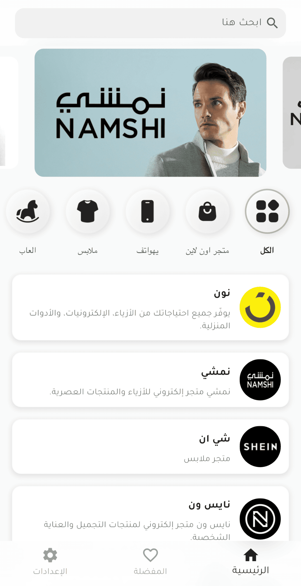
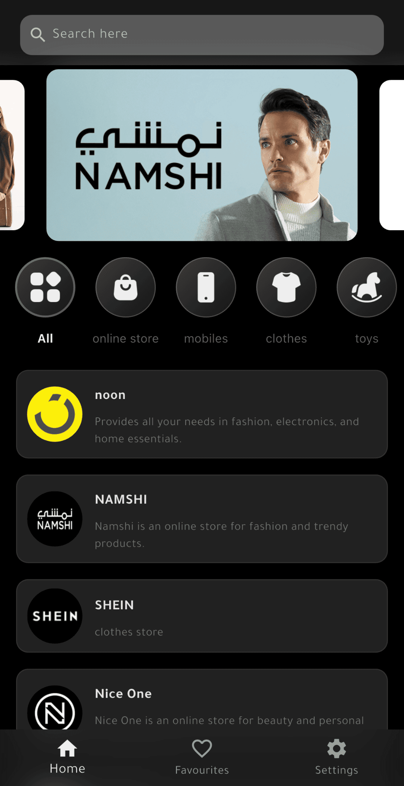
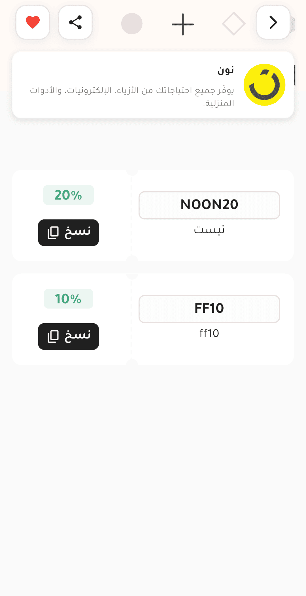
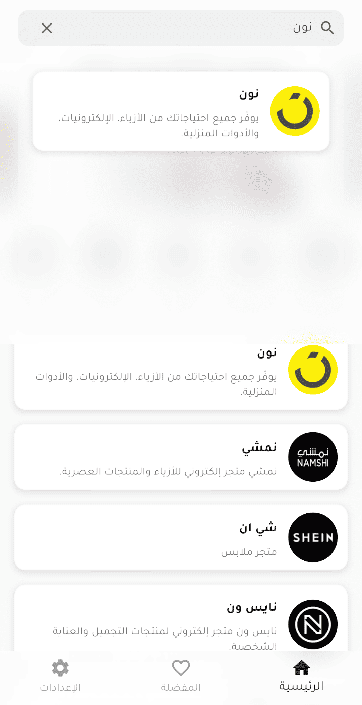
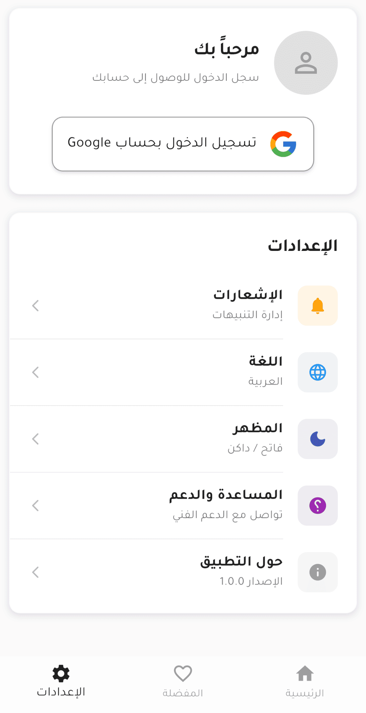

# Coupon & Store Discovery App

A Flutter application designed to browse stores, categories, and exclusive coupons. The app features a modern UI with theme support, localization, and Google authentication.

## 🚀 Key Features

*   **Authentication**
    *   Google Sign-In integration.
    *   Guest mode access.
    *   Secure token storage using `flutter_secure_storage`.
*   **Home Screen**
    *   Dynamic Banner Slider.
    *   Category filtering.
    *   Paginated Store listing with infinite scroll.
    *   Real-time Search functionality with debounce.
*   **Store & Coupons**
    *   Detailed store view with cover images.
    *   List of available coupons.
    *   "Copy Code" functionality with clipboard feedback.
    *   Analytics tracking for store views and coupon clicks.
*   **Favourites**
    *   Save/Remove stores to favourites (requires login).
    *   Synced with the backend.
*   **Settings & Customization**
    *   **Dark & Light Mode:** Toggleable theme support.
    *   **Localization:** Full support for Arabic (RTL) and English.
*   **UI/UX**
    *   Glassmorphism effects (Blur) on headers and navigation bar.
    *   Skeleton loading animations.
    *   Bounce animations on buttons and cards.

## 📸 Screenshots

| Home light mode | Home dark mode | Favourites |
|:---:|:---:|:---:|
| <!-- Insert Screenshot Here --> | <!-- Insert Screenshot Here --> | <!-- Insert Screenshot Here --> | <!-- Insert Screenshot Here --> |
|  |  |  |

| Store | Search | Settings |
|:---:|:---:|:---:|
|  |  |  |


## 🛠 Tech Stack

*   **Framework:** Flutter
*   **State Management:** Provider
*   **Networking:** http
*   **Local Storage:** shared_preferences & flutter_secure_storage
*   **Localization:** flutter_localizations & intl
*   **UI Components:**
    *   `skeletonizer` (Loading effects)
    *   `carousel_slider` (Banners)
    *   `flutter_bounceable` (Interactions)

## 📂 Project Structure

The project follows a **Feature-First** architecture:

```text
lib/
├── app/                 # Global app configuration & API services
├── core/                # Shared utilities (Theme, Logger, Locale, Constants)
├── features/            # Feature-specific code
│   ├── auth/            # Authentication logic & UI
│   ├── favourites/      # Favourites logic & UI
│   ├── home/            # Home screen, Banners, Search
│   ├── settings/        # Settings, Language, Theme controls
│   └── store_screen/    # Store details & Coupon logic
├── generated/           # Auto-generated localization files
└── main.dart            # Entry point
```

## ⚙️ Setup & Installation

1.  **Clone the repository.**
2.  **Install dependencies:**
    ```bash
    flutter pub get
    ```
3.  **Environment Variables:**
    Create a `.env` file in the root directory and add your API URL and Google Client ID:
    ```env
    BASE_URL=http://your-api-url.com
    GOOGLE_SERVER_CLIENT_ID=your-google-client-id
    ```
4.  **Run the app:**
    ```bash
    flutter run
    ```

## 📝 Localization

The app uses `flutter_localizations`. To add or modify strings:
1.  Edit the `.arb` files (or `l10n.yaml` configuration).
2.  Run the generator:
    ```bash
    flutter pub get
    ```
    *(The code provided uses `intl/generate_localized.dart` logic, usually handled by IDE plugins or build runner).*